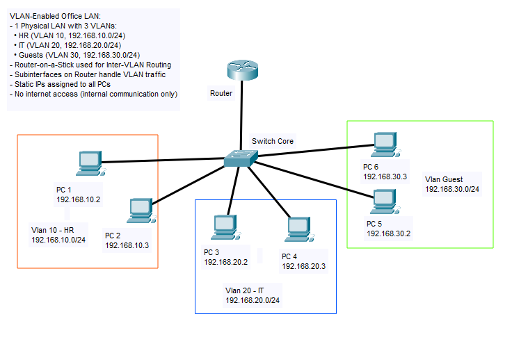

# 🧩 VLAN & Inter-VLAN Routing – Realistic Office Network

This project simulates a **mid-size office** network that utilizes **VLANs for network segmentation**, and **Inter-VLAN Routing** via **Router-on-a-Stick** to enable communication between departments.

---

## 🏢 Scenario Overview

A company has three departments:
- **Human Resources (HR)**
- **IT Support**
- **Guest**

To enhance security and traffic control, each department is assigned a separate **VLAN**. A central router is used to route traffic between VLANs using **subinterfaces** with `802.1Q` trunking.

This setup is built and tested using **Cisco Packet Tracer**.

---

## 🎯 Objectives

- Create 3 VLANs and assign PCs to each department.
- Configure static IP addressing per VLAN.
- Implement Inter-VLAN Routing using Router-on-a-Stick.
- Verify communication between VLANs and restrict Guest VLAN if needed.

---

## 🧰 Tools & Devices Used

- Cisco 2911 Router
- Cisco 2960 Switch (Core)
- 6x PC-PT (2 per department)
- Cisco Packet Tracer 8.x

---

## 🌐 Network Topology

---

## 🧠 VLAN & IP Addressing Plan

### 🧠 VLAN Plan

| VLAN | Dept.   | Subnet           | Gateway       | PCs                  |
|------|---------|------------------|---------------|-----------------------|
| 10   | HR      | 192.168.10.0/24  | 192.168.10.1  | PC1, PC2             |
| 20   | IT      | 192.168.20.0/24  | 192.168.20.1  | PC3, PC4             |
| 30   | Guest   | 192.168.30.0/24  | 192.168.30.1  | PC5, PC6             |

### 🧠 IP Address Plan

| Device | IP Address     | Subnet Mask     | Gateway        |
|--------|----------------|-----------------|----------------|
| PC1    | 192.168.10.2   | 255.255.255.0   | 192.168.10.1   |
| PC2    | 192.168.10.3   | 255.255.255.0   | 192.168.10.1   |
| PC3    | 192.168.20.2   | 255.255.255.0   | 192.168.20.1   |
| PC4    | 192.168.20.3   | 255.255.255.0   | 192.168.20.1   |
| PC5    | 192.168.30.2   | 255.255.255.0   | 192.168.30.1   |
| PC6    | 192.168.30.3   | 255.255.255.0   | 192.168.30.1   |

---

## 🔧 Configuration Overview

### Router (2911 - Router-on-a-Stick)

- Interface G0/0 (trunk) connected to Core Switch
- Subinterfaces configured for:
  - VLAN 10 (HR): `192.168.10.1`
  - VLAN 20 (IT): `192.168.20.1`
  - VLAN 30 (Guest): `192.168.30.1`

### Core Switch (2960)

- Fa0/1 is the trunk port to the router
- VLANs configured:
  - VLAN 10: HR (PC1, PC2)
  - VLAN 20: IT (PC3, PC4)
  - VLAN 30: Guest (PC5, PC6)
- Access ports assigned per VLAN

### PCs

- Static IPs set manually per VLAN
- Default gateway points to respective router subinterface

---

## 🔧 Configuration Files

All device configurations are available in the [`config/`](./config) folder.

| Device | File                         |
|--------|------------------------------|
| Router | `config/router-config.txt`   |
| Switch | `config/switch-core.txt`     |
| PCs    | Manual IP setup (see [VLAN & IP Addressing Plan](#-vlan--ip-addressing-plan)) |

Each configuration includes:
- VLAN creation and assignment
- Trunk and access port setup
- Subinterface routing (802.1Q encapsulation)

---

## ✅ Testing Checklist

| Test                                     | Result |
|------------------------------------------|--------|
| PC1 ↔ PC2 (HR VLAN 10)                   | ✅     |
| PC3 ↔ PC4 (IT VLAN 20)                   | ✅     |
| PC5 ↔ PC6 (Guest VLAN 30)                | ✅     |
| PC1 ↔ PC3 (HR ↔ IT, inter-VLAN routing)  | ✅     |
| PC1 ↔ PC5 (HR ↔ Guest)                   | ✅     |
| Vlan table                               | ✅     |

---

## 📸 Testing Evidence

All test results are documented with screenshots in the [`screenshots/`](./screenshots) folder:

- `ping_hr_local.png` → Intra-VLAN test: PC1 to PC2 (HR)
- `ping_it_local.png` → Intra-VLAN test: PC3 to PC4 (IT)
- `ping_guest_local.png` → Intra-VLAN test: PC5 to PC6 (Guest)
- `ping_hr_to_it.png` → Inter-VLAN test: PC1 (HR) to PC3 (IT)
- `ping_hr_to_guest.png` → Inter-VLAN test: PC1 (HR) to PC5 (Guest, optional)
- `vlan_table.png` → VLAN ID to Port Mapping table from switch

---

## 🧩 Troubleshooting Tips

| Issue                                | Solution                                             |
|--------------------------------------|------------------------------------------------------|
| VLAN PCs can't reach router          | Check trunk configuration on switch/router          |
| No ping between VLANs                | Ensure subinterfaces are up and encapsulated properly |
| PCs in wrong VLAN                    | Verify switchport access VLAN assignments           |
| No IP/gateway response               | Double-check static IP and gateway config on PCs    |

---

## 📦 Project Files

You can download and open the full simulation in [Cisco Packet Tracer](https://www.netacad.com/):

- [`packet-tracer/vlan-intervlan-final.pkt`](./packet-tracer/vlan-intervlan-final.pkt)

**Contents:**
- VLAN setup with inter-VLAN routing
- Router-on-a-Stick configuration
- IP setup and connectivity testing

Open with Cisco Packet Tracer 8.x or later.

---

## 📎 Notes

- VLAN 30 (Guest) can optionally be restricted in future ACL project.
- This project leads into:
  - DHCP per VLAN
  - Access Control Lists (ACLs)
  - SNMP-based Monitoring

---

## 📚 References

- [Cisco VLAN Configuration Guide](https://www.cisco.com/c/en/us/support/docs/lan-switching/vlan/10023-3.html)
- [Router-on-a-Stick Explained](https://www.networkstraining.com/router-on-a-stick-configuration/)