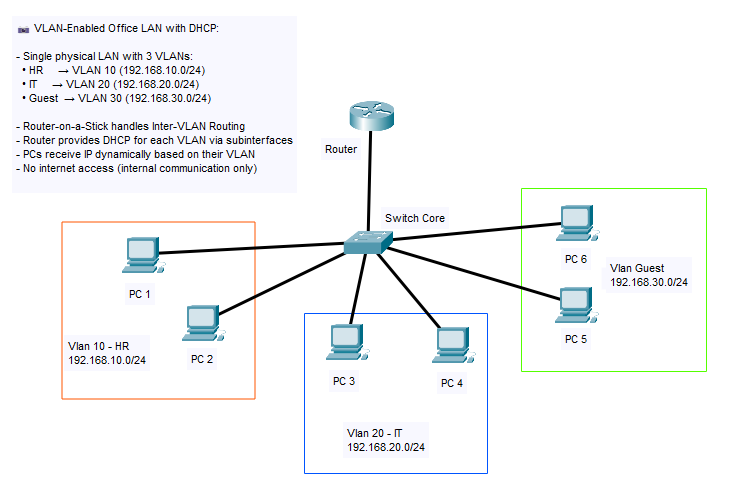

# 📡 VLAN + DHCP – Dynamic IP for Office Network

This project extends the VLAN-based office setup by implementing **DHCP for each VLAN**, enabling devices to automatically obtain IP addresses. The router acts as a DHCP server and assigns IPs to clients based on their VLAN segment.

---

## 🏢 Scenario Overview

The company has three departments:
- **HR**
- **IT Support**
- **Guest**

Each department is assigned a **VLAN** and subnet. Instead of static IP assignment, the router dynamically provides IPs using **DHCP pools per VLAN**. Inter-VLAN routing is maintained via **Router-on-a-Stick**.

This setup is built and tested using **Cisco Packet Tracer**.

---

## 🎯 Objectives

- Configure DHCP pools on the router for each VLAN.
- Assign clients to the correct VLAN and verify automatic IP assignment.
- Ensure inter-VLAN routing remains functional.
- Validate full end-to-end connectivity.

---

## 🧰 Tools & Devices Used

- Cisco 2911 Router (DHCP server + Inter-VLAN Routing)
- Cisco 2960 Switch (Core)
- 6x PC-PT (2 per department)
- Cisco Packet Tracer 8.x

---

## 🌐 Network Topology

---

## 🧠 VLAN & DHCP IP Plan

### 🧠 VLAN Plan

| VLAN | Dept.   | Subnet           | Gateway       | DHCP Range              | PCs          |
|------|---------|------------------|---------------|--------------------------|--------------|
| 10   | HR      | 192.168.10.0/24  | 192.168.10.1  | 192.168.10.100–199      | PC1, PC2     |
| 20   | IT      | 192.168.20.0/24  | 192.168.20.1  | 192.168.20.100–199      | PC3, PC4     |
| 30   | Guest   | 192.168.30.0/24  | 192.168.30.1  | 192.168.30.100–199      | PC5, PC6     |

---

## 🔧 Configuration Overview

### Router (2911)

- G0/0 with subinterfaces:  
  - `.10` → VLAN 10  
  - `.20` → VLAN 20  
  - `.30` → VLAN 30
- DHCP Pools defined for each VLAN
- Excluded addresses configured to reserve gateways

### Switch (2960)

- VLANs created: 10, 20, 30
- Trunk port to router (Fa0/7)
- Access ports assigned per department

### PCs

- IP Config set to DHCP (automatic)
- Receive IPs based on connected VLAN

---

## 🔧 Configuration Files

All device configurations are available in the [`config/`](./config) folder.

| Device | File                         |
|--------|------------------------------|
| Router | `config/router-config.txt`   |
| Switch | `config/switch-config.txt`   |
| PCs    | DHCP auto (no manual config) |

Each configuration includes:
- DHCP pools for each subnet
- VLANs and access port mapping
- Subinterfaces with 802.1Q encapsulation

---

## ✅ Testing Checklist

| Test                                         | Result |
|----------------------------------------------|--------|
| PC1 & PC2 get DHCP IP (VLAN 10 - HR)         | ✅     |
| PC3 & PC4 get DHCP IP (VLAN 20 - IT)         | ✅     |
| PC5 & PC6 get DHCP IP (VLAN 30 - Guest)      | ✅     |
| PC1 ↔ PC3 (HR ↔ IT, inter-VLAN routing)      | ✅     |
| PC3 ↔ PC5 (IT ↔ Guest, inter-VLAN routing)   | ✅     |
| DHCP pool configuration                      | ✅     |
| DHCP binding table                           | ✅     |
| Vlan table                                   | ✅     |

---

## 📸 Testing Evidence

Screenshots are available in the [`screenshots/`](./screenshots) folder:

- `dhcp-success-hr.png` → IP auto-assigned to PC1 (HR)
- `dhcp-success-it.png` → IP auto-assigned to PC3 (IT)
- `dhcp-success-guest.png` → IP auto-assigned to PC5 (Guest)
- `ping-hr-to-it.png` → Inter-VLAN test: PC1 to PC3
- `ping-it-to-guest.png` → Inter-VLAN test: PC3 to PC5
- `router-dhcp-pools.png` → Router DHCP pool configuration
- `router-dhcp-binding.png` → Router DHCP binding view
- `vlan-table.png` → VLAN ID to Port Mapping table from switch

---

## 🧩 Troubleshooting Tips

| Issue                            | Solution                                       |
|----------------------------------|------------------------------------------------|
| PC not receiving IP              | Check switch VLAN access & router pool config |
| Wrong subnet IP assigned         | Verify port-to-VLAN mapping on switch         |
| Inter-VLAN ping fails            | Ensure subinterfaces and trunk are active     |
| DHCP pool not working            | Check `excluded-address`, `network`, `router` |

---

## 📦 Project Files

You can open the simulation in [Cisco Packet Tracer](https://www.netacad.com/):

- [`packet-tracer/vlan-dhcp-final.pkt`](./packet-tracer/vlan-dhcp-final.pkt)

**Contents:**
- VLAN segmentation
- DHCP pools per VLAN
- Subinterface routing
- Functional end-to-end connectivity

---

## 📎 Notes

- This project is part of a modular series:
  - `01-basic-lan/`
  - `02-lan-vlan/`
  - `03-lan-dhcp/`
  - `04-lan-firewall-acl/` (up next!)
- Can be extended with DNS, centralized DHCP, or ACL restrictions.

---
