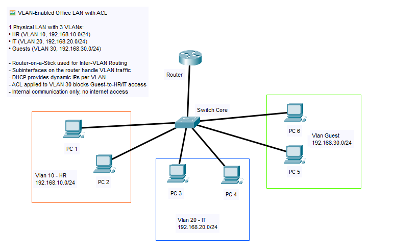

# 🔒 VLAN + ACL – Office Network Access Control

This project builds on the VLAN + DHCP setup by introducing **Access Control Lists (ACLs)** to limit inter-VLAN communication. Specifically, we restrict **Guest VLAN (30)** from accessing internal departments like **HR (10)** and **IT (20)**, while still allowing HR and IT to communicate freely.

---

## 🏢 Scenario Overview

Same 3 VLANs:
- **HR** (VLAN 10)
- **IT** (VLAN 20)
- **Guest** (VLAN 30)

All VLANs get IP via DHCP, and Router-on-a-Stick still provides inter-VLAN routing. Now, we implement ACL rules on the **router subinterfaces** to:
- Deny Guest VLAN → HR/IT
- Allow HR ↔ IT
- Allow Guest → Internet or ping router (optional)

---

## 🎯 Objectives

- Create ACLs to restrict access **from Guest VLAN (30)** to others
- Apply ACLs to router interfaces using `ip access-group`
- Validate that Guest users **cannot access** internal resources
- Keep HR & IT communication functional

---

## 🧰 Tools & Devices Used

- Cisco 2911 Router (with ACL config)
- Cisco 2960 Switch
- 6x PC-PT clients
- Cisco Packet Tracer 8.x

---

## 🌐 Network Topology

---

## 🔐 ACL Policy Plan

| Source VLAN | Destination VLAN | Access   | Rule                 |
|-------------|------------------|----------|----------------------|
| Guest (30)  | HR (10)          | ❌ Deny  | Block via ACL        |
| Guest (30)  | IT (20)          | ❌ Deny  | Block via ACL        |
| HR (10)     | IT (20)          | ✅ Allow | No restriction       |
| All VLANs   | Router Gateway   | ✅ Allow | DHCP & ping gateway  |

---

## 🧠 VLAN & DHCP IP Plan

### 🧠 VLAN Plan

| VLAN | Dept.   | Subnet           | Gateway       | DHCP Range              | PCs          |
|------|---------|------------------|---------------|--------------------------|--------------|
| 10   | HR      | 192.168.10.0/24  | 192.168.10.1  | 192.168.10.100–199      | PC1, PC2     |
| 20   | IT      | 192.168.20.0/24  | 192.168.20.1  | 192.168.20.100–199      | PC3, PC4     |
| 30   | Guest   | 192.168.30.0/24  | 192.168.30.1  | 192.168.30.100–199      | PC5, PC6     |

---

## 🔧 Configuration Overview

### Router (2911)

- G0/0 with subinterfaces:  
  - `.10` → VLAN 10  
  - `.20` → VLAN 20  
  - `.30` → VLAN 30
- DHCP Pools defined for each VLAN (same as previous project)
- ACL applied to VLAN 30 (Guest) to block access to HR and IT
- Excluded addresses configured to reserve gateways

### Switch (2960)

- VLANs created: 10, 20, 30
- Trunk port to router (Fa0/7)
- Access ports assigned per department

### PCs

- IP Config set to DHCP (automatic)
- Receive IPs based on connected VLAN

---

## 🔧 Configuration Files

All device configurations are available in the [`config/`](./config) folder.

| Device | File                         |
|--------|------------------------------|
| Router | [`config/router-config.txt`](./config/router-config.txt)   |
| Switch | [`config/switch-config.txt`](./config/switch-config.txt)   |
| PCs    | DHCP auto (no manual config) |

Each configuration includes:
- DHCP pools for each subnet
- VLANs and access port mapping
- Subinterfaces with 802.1Q encapsulation
- ACL rules and application

---

## ✅ Testing Checklist

| Test                                         | Result |
|----------------------------------------------|--------|
| PC1 & PC2 get DHCP IP (VLAN 10 - HR)         | ✅     |
| PC3 & PC4 get DHCP IP (VLAN 20 - IT)         | ✅     |
| PC5 & PC6 get DHCP IP (VLAN 30 - Guest)      | ✅     |
| PC1 ↔ PC3 (HR ↔ IT, inter-VLAN routing)      | ✅     |
| PC5 ↔ PC3 or PC 1 (Guest → HR/IT)            | ❌ Blocked     |
| PC5 ↔ Gateway (Router IP)                    | ✅     |
| ACL config applied on router subinterface    | ✅     |
| Vlan table verification                      | ✅     |

---

## 📸 Testing Evidence

Screenshots are available in the [`screenshots/`](./screenshots) folder:

- [`dhcp-success-hr.png`](./screenshots/dhcp-success-hr.png) → IP auto-assigned to PC1 (HR)
- [`dhcp-success-it.png`](./screenshots/dhcp-success-it.png) → IP auto-assigned to PC3 (IT)
- [`dhcp-success-guest.png`](./screenshots/dhcp-success-guest.png) → IP auto-assigned to PC5 (Guest)
- [`ping-hr-to-it.png`](./screenshots/ping-hr-to-it.png) → Inter-VLAN test: PC1 to PC3
- [`ping-guest_blocked.png`](./screenshots/ping-guest-blocked.png) → Ping blocked: PC5 to PC1 or PC3
- [`ping-guest-to-gateway.png`](./screenshots/ping-guest-to-gateway.png) → PC5 can reach the gateway
- [`acl-configuration.png`](./screenshots/acl-configuration.png) → ACL configuration on router subinterface view
- [`vlan-table.png`](./screenshots/vlan-table.png) → VLAN ID to Port Mapping table from switch

---

## 🧩 Troubleshooting Tips

| Issue                            | Solution                                       |
|----------------------------------|------------------------------------------------|
| ACL not working                  | Ensure `ip access-group` applied on interface |
| Guest can still ping HR/IT	     | Check ACL rule order and direction (inbound)  |
| Legit traffic also blocked       | Make sure last rule is `permit ip any any`    |
| Inter-VLAN ping fails (HR/IT)    | Verify trunk and subinterface status          |

---

## 📦 Project Files

You can open the simulation in [Cisco Packet Tracer](https://www.netacad.com/):

- [`packet-tracer/vlan-acl-final.pkt`](./packet-tracer/)

**Contents:**
- VLAN segmentation with DHCP
- Inter-VLAN ACL configuration
- Dynamic IP + restricted Guest access

---

## 📎 Notes

- This project is part of a modular series:
  - [`01-basic-lan/`](/01-basic-lan/)
  - [`02-lan-vlan/`](/02-lan-vlan/)
  - [`03-lan-dhcp/`](/03-lan-dhcp/)
  - `04-lan-firewall-acl/` ✅ (this one!)
- Can be extended with:
  - ACL logging
  - Time-based ACL
  - NAT or internet restriction policies
- ACL is applied inbound on VLAN 30 interface
---

## 📌 ACL Inbound vs Outbound – Behavior Explanation

When applying ACLs on router interfaces, the **direction of application (`in` or `out`) affects the type of response when traffic is denied**:

| Direction | What happens when ACL denies traffic        | Result seen by user         |
|-----------|----------------------------------------------|------------------------------|
| `in`      | Traffic is blocked **as it enters** the router | ❗ Destination Host Unreachable |
| `out`     | Traffic is blocked **before it exits** the router | ⛔ Request Timed Out (RTO)      |

### ✅ Why This Happens:
- When using `ip access-group BLOCK_GUEST in` on a subinterface (e.g., G0/0.30), **ICMP Echo Requests from Guest get denied before even entering the router**, and the router **generates an ICMP "Destination Unreachable"** message in response.
- If the ACL is placed outbound (e.g., on G0/0.10 going out to HR), the packet is accepted initially, but dropped before exiting — so **no response is generated**, leading to a classic **RTO (Request Timed Out)**.

### 💡 Best Practice:
Inbound ACLs are **preferred** for controlling who gets in from specific subnets (e.g., restricting Guest VLAN), and also make it easier to **trace deny messages** during testing.

---