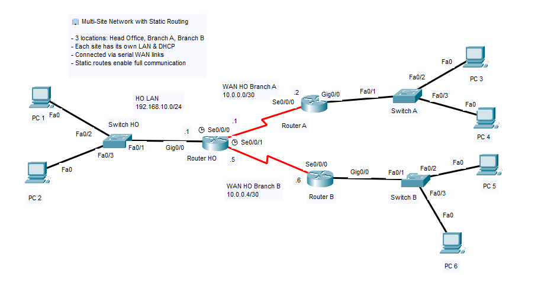

# 🌐 Multi-Site LAN with Static Routing

This project simulates a **company with multiple branch offices**, each having its own local network (LAN). The branches are connected through routers, forming a wide area network (WAN). Devices from one branch can communicate with devices in other branches using **static routing** configured on each router.

---

## 🏢 Scenario Overview

A mid-sized company has **three locations**:
- **Head Office (HO)** – Main location with HR & Finance
- **Branch A** – Handles Sales team
- **Branch B** – Handles Support team

Each site operates its own LAN with different subnets. Routers at each site are directly connected to each other over **serial point-to-point WAN links**. **Static routes** are configured manually on each router to enable full end-to-end connectivity.

This setup is built and tested using **Cisco Packet Tracer**.

---

## 🎯 Objectives

- Design and simulate a multi-branch LAN network.
- Assign unique subnets to each location.
- Interconnect sites using routers and WAN links.
- Configure static routes so all PCs can communicate.
- Verify connectivity across all sites.

---

## 🧰 Tools & Devices Used

- 3x Cisco 2911 Routers
- 3x Cisco 2960 Switches
- 6x PC-PT Clients (2 per site)
- 2x Serial WAN Links (DCE/DTE)
- Cisco Packet Tracer 8.x

---

## 🌐 Network Topology

---

## 🧠 Subnets per Site:
- HO (Head Office): `192.168.10.0/24`
- Branch A: `192.168.20.0/24`
- Branch B: `192.168.30.0/24`
- WAN HO ↔ A: `10.0.0.0/30`
- WAN HO ↔ B: `10.0.0.4/30`

---

## 🧠 IP Addressing Plan

| Site       | Device        | Interface     | IP Address       | Notes              |
|------------|---------------|---------------|------------------|---------------------|
| Head Office | Router-HO    | G0/0 (LAN)     | 192.168.10.1     | Default GW for HO   |
|            |               | S0/0/0 (WAN A) | 10.0.0.1         | ↔ Branch A          |
|            |               | S0/0/1 (WAN B) | 10.0.0.5         | ↔ Branch B          |
| Branch A   | Router-A      | G0/0 (LAN)     | 192.168.20.1     | Default GW for A    |
|            |               | S0/0/0         | 10.0.0.2         | ↔ Head Office       |
| Branch B   | Router-B      | G0/0 (LAN)     | 192.168.30.1     | Default GW for B    |
|            |               | S0/0/0         | 10.0.0.6         | ↔ Head Office       |
| PCs        | PC1–PC6       | NIC            | DHCP             | per-site subnet     |

---

## 🔧 Configuration Overview

### 🛠️ Router Configuration

Each router is responsible for:
- **Assigning IP addresses via DHCP** to its local LAN
- **Setting up static routes** to reach other branch networks
- **Configuring serial interfaces** for WAN links

#### 🔹 Head Office (Router-HO)

- LAN IP: `192.168.10.1/24`
- DHCP Pool: 192.168.10.100–199
- Static routes:
  - To Branch A → via `10.0.0.2`
  - To Branch B → via `10.0.0.6`

#### 🔹 Branch A (Router-A)

- LAN IP: `192.168.20.1/24`
- DHCP Pool: 192.168.20.100–199
- Static route:
  - To HO & Branch B → via `10.0.0.1`

#### 🔹 Branch B (Router-B)

- LAN IP: `192.168.30.1/24`
- DHCP Pool: 192.168.30.100–199
- Static route:
  - To HO & Branch A → via `10.0.0.5`

---

## 📁 Configuration Files

Available in the [`config/`](./config) folder:

| Device     | File                     |
|------------|--------------------------|
| Router-HO  | [`router-ho-config.txt`](./config/router-ho-config.txt)   |
| Router-A   | [`router-a-config.txt`](./config/router-a-config.txt)    |
| Router-B   | [`router-b-config.txt`](./config/router-b-config.txt)    |
| Switch-HO  | [`switch-ho-config.txt`](./config/switch-ho-config.txt)     |
| Switch-A   | [`switch-a-config.txt`](./config/switch-a-config.txt)     |
| Switch-B   | [`switch-b-config.txt`](./config/switch-b-config.txt)     |
| PCs        | DHCP (auto-configured)   |

Each config includes:
- Interface IPs (LAN + WAN)
- DHCP pool per site
- Static routes for full communication

---

## ✅ Testing Checklist

| Test                                        | Result |
|---------------------------------------------|--------|
| PC1 ↔ PC2 (HO local communication)          | ✅     |
| PC3 ↔ PC4 (Branch A local communication)    | ✅     |
| PC5 ↔ PC6 (Branch B local communication)    | ✅     |
| PC1 ↔ PC3 (HO ↔ Branch A, routed)           | ✅     |
| PC1 ↔ PC5 (HO ↔ Branch B, routed)           | ✅     |
| PC3 ↔ PC5 (Branch A ↔ Branch B, routed)     | ✅     |
| DHCP IP received at all sites               | ✅     |
| Show IP Route table on all routers          | ✅     |

---

## 📸 Testing Evidence

Screenshots are available in the [`screenshots/`](./screenshots) folder:

- [`dhcp-pc1.png`](./screenshots/dhcp-pc1.png) → PC1 gets IP from HO DHCP
- [`dhcp-pc3.png`](./screenshots/dhcp-pc3.png) → PC3 gets IP from Branch A DHCP
- [`dhcp-pc5.png`](./screenshots/dhcp-pc5.png) → PC5 gets IP from Branch B DHCP
- [`ping-ho-to-a.png`](./screenshots/ping-ho-to-a.png) → Ping from PC1 (HO) to PC3 (Branch A)
- [`ping-ho-to-b.png`](./screenshots/ping-ho-to-b.png) → Ping from PC1 (HO) to PC5 (Branch B)
- [`ping-a-to-b.png`](./screenshots/ping-a-to-b.png) → Ping from PC3 to PC5
- [`router-ho-show-ip-route.png`](./screenshots/router-ho-show-ip-route.png) → HO Router routing table
- [`router-a-show-ip-route.png`](./screenshots/router-a-show-ip-route.png) → Router A routing table
- [`router-b-show-ip-route.png`](./screenshots/router-b-show-ip-route.png) → Router B routing table

---

## 🧩 Troubleshooting Tips

| Issue                                      | Solution                                           |
|-------------------------------------------|----------------------------------------------------|
| PC doesn’t receive IP                     | Check DHCP pool config & excluded address range    |
| Ping fails between branches               | Verify static routes on all routers                |
| Serial interfaces down                    | Ensure both ends are `no shutdown` + DCE has clock |
| Routing table incomplete                  | Check `show ip route` for missing networks         |
| PC can ping router but not other site     | Check if next-hop router has proper return routes  |

---

## 📦 Project Files

This project is available for download and simulation using [Cisco Packet Tracer](https://www.netacad.com/):

- [`packet-tracer/static-routing-multisite.pkt`](./packet-tracer)

**Included:**
- 3 routers with static routing configured
- Site-local DHCP and LAN setups
- Switches, PCs (DHCP-enabled), and testing PCs

---

## 📎 Notes

- This project simulates a small-scale **WAN interconnection** using static routing.
- Perfect as a base for:
  - Dynamic routing protocol (RIP, OSPF) upgrade
  - VPN or tunneling simulation (in more advanced tools)
  - Firewall rules between sites (via ACLs)

📌 Tips:
- Label interfaces and IPs in your Packet Tracer file for clarity.
- Use `ping` and `traceroute` from each site to simulate real-world connectivity check.
- For bonus challenge: disable 1 WAN link and reroute manually.
---